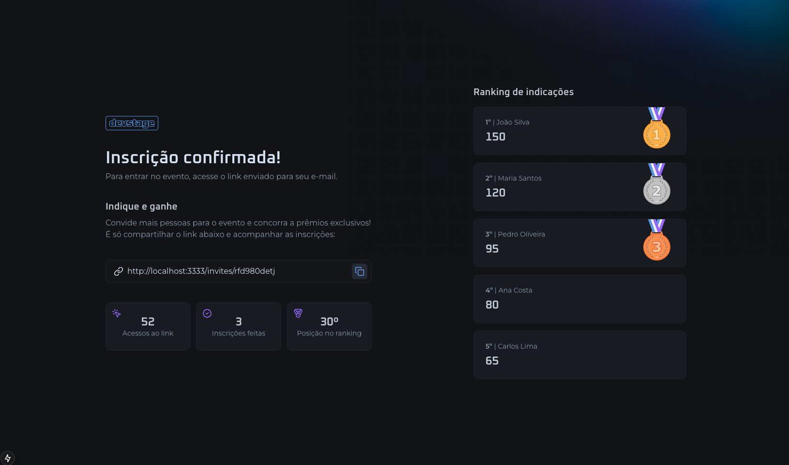
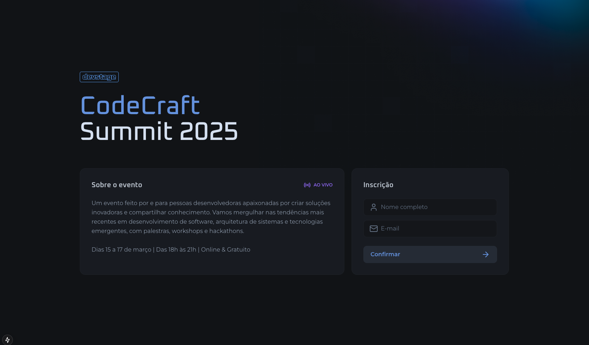

# CodeCraft Summit 2025 - Sistema de Inscrições e Indicações

### Página Inicial - Inscrição no Evento


### Página de Indicações - Ranking e Estatísticas


Este é um projeto desenvolvido em Next.js para o evento **CodeCraft Summit 2025**, um evento online e gratuito voltado para desenvolvedores apaixonados por tecnologia.

## 📋 Sobre o Projeto

O sistema permite que os usuários:
- Se inscrevam no evento fornecendo nome e e-mail
- Recebam um link personalizado de indicação após a inscrição
- Indiquem outros participantes através do seu link único
- Acompanhem suas estatísticas de indicações
- Visualizem o ranking geral de indicações com sistema de medalhas

## 🎯 Funcionalidades

- **Formulário de Inscrição**: Interface intuitiva para cadastro no evento
- **Sistema de Indicações**: Cada usuário recebe um link único para indicar outros participantes
- **Ranking em Tempo Real**: Visualização do ranking de indicações com medalhas (ouro, prata e bronze)
- **Estatísticas Pessoais**: Acompanhamento individual das indicações realizadas
- **Design Responsivo**: Interface adaptada para desktop e mobile

## 🚀 Tecnologias Utilizadas

- **Next.js 15** - Framework React com App Router
- **TypeScript** - Tipagem estática
- **Tailwind CSS** - Estilização
- **React Hook Form** - Gerenciamento de formulários
- **Zod** - Validação de schemas
- **Lucide React** - Ícones
- **Biome** - Linting e formatação

## 🛠️ Como Executar

Primeiro, instale as dependências:

```bash
npm install
# ou
yarn install
```

Em seguida, execute o servidor de desenvolvimento:

```bash
npm run dev
# ou
yarn dev
```

Abra [http://localhost:3000](http://localhost:3000) no seu navegador para ver o resultado.

## 📁 Estrutura do Projeto

```
src/
├── app/
│   ├── (home)/                 # Página inicial com formulário de inscrição
│   ├── invite/[subscriberId]/  # Página de indicações e ranking
│   ├── api/                    # Rotas da API
│   └── components/             # Componentes reutilizáveis
├── assets/                     # Imagens e ícones SVG
└── http/                       # Configuração da API
```

## 🎨 Design System

O projeto utiliza um design system consistente com:
- Paleta de cores focada em tons de cinza com acentos em azul e roxo
- Tipografia hierárquica com fontes personalizadas
- Componentes reutilizáveis (Button, Input, etc.)
- Layout responsivo com breakpoints bem definidos

## 📅 Sobre o Evento

**CodeCraft Summit 2025**
- **Data**: 15 a 17 de março de 2025
- **Horário**: Das 18h às 21h
- **Formato**: Online e Gratuito
- **Foco**: Desenvolvimento de software, arquitetura de sistemas e tecnologias emergentes

O evento inclui palestras, workshops e hackathons para desenvolvedores de todos os níveis.

## 🏆 Sistema de Gamificação

O projeto implementa um sistema de gamificação onde:
- Usuários ganham pontos por cada indicação bem-sucedida
- Ranking em tempo real com medalhas para os top 3
- Estatísticas individuais de performance
- Incentivo à participação através de prêmios exclusivos

---

Desenvolvido durante o NLW Connect da Rocketseat 🚀
